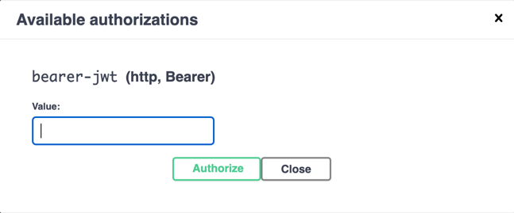

### Prerequisites

* `Java 21` should be installed --> `export JAVA_HOME=$(/usr/libexec/java_home -v 21)`
* `Docker` should be installed
* `Maven` should be installed
* `pgAdmin`/`DBeaver` can be installed (Optional)

-----

### How to start the application

1. Run `mvn clean install` or `mvn clean package`
2. Run `mvn spring-boot:run` or `./mvnw spring-boot:run`

-----

### How to test the application

* Run `mvn test` or `mvn clean install` or `mvn clean package` command to run all the tests
* Swagger Url: http://localhost:8080/swagger-ui.html
* Test User to Get JWT Token via `/auth/signin` API:
    * `username: admin_user`
    * `password: test1234`
    * Copy the generated token and paste it to the following popup in `Swagger`
        * 
* Actuator Url: http://localhost:8080/actuator
* Metric Url: http://localhost:8080/actuator/metrics

-----

### `docker-compose` contains the followings

* PostgreSQL DB connection details
    * `POSTGRES_USER: postgres`
    * `POSTGRES_PASSWORD: postgres`
    * `Port: 5432`
* Zipkin: http://localhost:9411/
* Prometheus: http://localhost:9090/graph
* Grafana: http://localhost:3000/
    * `Email or username: admin`
    * `Password: admin`
    * Add datasource
        * Select Prometheus
        * Prometheus Url: http://prometheus:9090/
        * Save & test
* Kafka-UI: http://localhost:9091/

-----